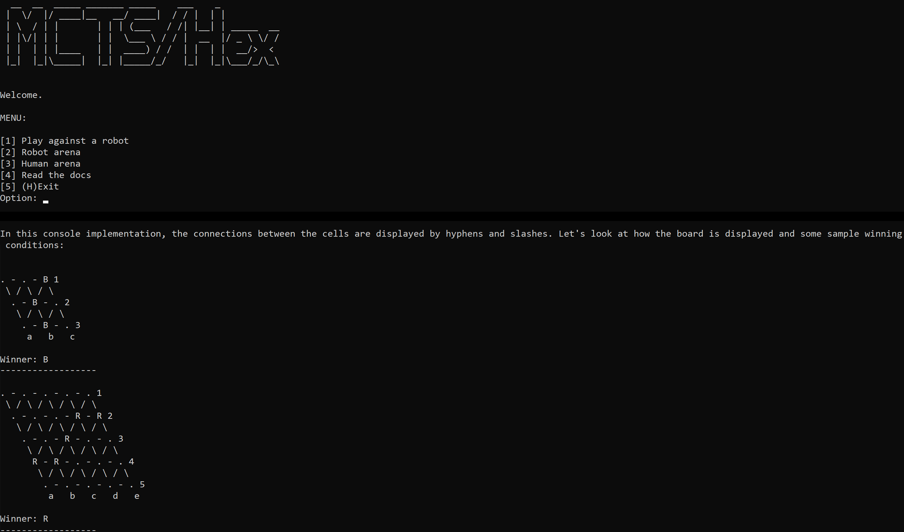

# Hex Board Game with Monte Carlo Tree Search Agent in C++14

## Overview
This repository contains an implementation of the board game of [Hex](https://en.wikipedia.org/wiki/Hex_(board_game)) with an agent based on [Monte Carlo Tree Search](https://en.wikipedia.org/wiki/Monte_Carlo_tree_search) (MCTS) utilizing optional [leaf parallelization](https://en.wikipedia.org/wiki/Monte_Carlo_tree_search#:~:text=Leaf%20parallelization) using standard C++14 libraries in a console interface. The MCTS agent has configurable hyperparameters, and the size of the board is variable.

## Features
The application includes several modes of gameplay:

- **Human vs Robot:** A user competes against the AI.
- **Robot vs Robot:** Two AI agents compete, allowing for evaluation and comparison of different hyperparameters.
- **Human vs Human:** Two users compete, each taking turns on the same console.

A feature of particular interest to those studying MCTS is the optional logging functionality. When the agent is run in single-threaded mode, it is capable of producing a detailed log, showing the decision-making process behind each move across MCTS iterations.

## Structure

- `Cell_state`: an enum to represent the state of a cell on a Hex game board, which could either be empty or claimed by a player (Blue or Red).
- `Board`: represents the Hex game board, providing functionality for its initialization, move validation, game state representation, determining the game outcome using recursive [depth-first search](https://en.wikipedia.org/wiki/Depth-first_search), and visualization.
- `Mcts_agent`: an implementation of the MCTS algorithm that simulates game play to select the most promising move, supporting optional thread-safe parallelization for improved performance and detailed logging. A `Node` of the game tree is a nested class.
- `Logger`: a thread-safe, singleton utility used for logging operations and state changes in the Monte Carlo Tree Search (MCTS) algorithm. It is used as a member class of `Mcts_agent`.
- `Player`: an abstract base class that outlines the necessary structure and methods for any player type in a game, with `Human_player` and `Mcts_player` as concrete subclasses representing a human player and a player that uses MCTS.
- `Game`: encapsulates a complete Hex game, handling the game loop, player turns, board management, and state transitions for two players.
- `console_interface`: a suite of functions that provide an interactive console interface for users to set up and play different configurations of the Hex game, handle user input validation, manage game parameters, and display relevant game information.
- `main`: calls the `run_console_interface` function.

For more detailed docs, refer to the corresponding header files.

## Usage
The simplest way to build the program may be to use Visual Studio with C++ Desktop Development. Having installed it, click the green 'Code' button at the top of the page, and choose 'Open with Visual Studio'. Then, build the project having selected the `CMakeLists.txt` file.

Additionally, `Makefile` is provided.

Contributions to this project are welcome. Happy coding!
