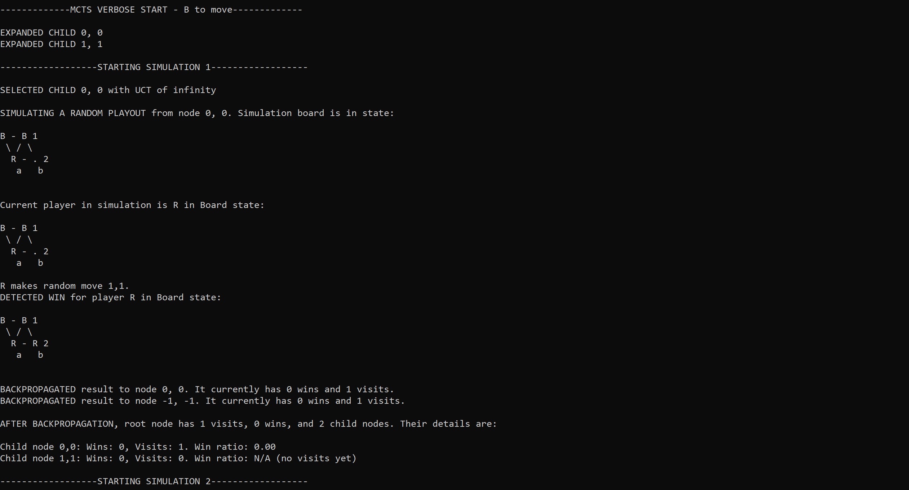

# Hex Board Game with Monte Carlo Tree Search Agent in C++14

## Overview
This repository contains an implementation of the board game of [Hex](https://en.wikipedia.org/wiki/Hex_(board_game)) with an agent based on [Monte Carlo Tree Search](https://en.wikipedia.org/wiki/Monte_Carlo_tree_search) (MCTS) utilizing optional [leaf parallelization](https://en.wikipedia.org/wiki/Monte_Carlo_tree_search#:~:text=Leaf%20parallelization) using standard C++14 libraries in a console interface. The MCTS agent has configurable hyperparameters, and the size of the board is variable.

## Features

The application includes several modes of gameplay:

- **Human vs Robot:** A user competes against the AI.
- **Robot vs Robot:** Two AI agents compete, allowing for evaluation and comparison of different hyperparameters.
- **Human vs Human:** Two users compete, each taking turns on the same console.

A feature of particular interest to those studying MCTS is the optional logging functionality. When the agent is run in single-threaded mode, it is capable of producing a detailed log, showing the decision-making process behind each move across MCTS iterations.

## Structure

- `cell_state`: an enumeration type to represent the state of a cell on a Hex game board, which could either be empty or claimed by a player (Blue or Red).
- 
- `board`: represents the Hex game board, providing functionality for its initialization, move validation, game state representation, determining the game outcome using recursive [depth-first search](https://en.wikipedia.org/wiki/Depth-first_search), and visualization.

- `mcts_agent`: 

- `logger`: 

- `player`: 

- `game`:

- `console_interface`:

- `main`:

For more detailed documentation, refer to the corresponding header files.
